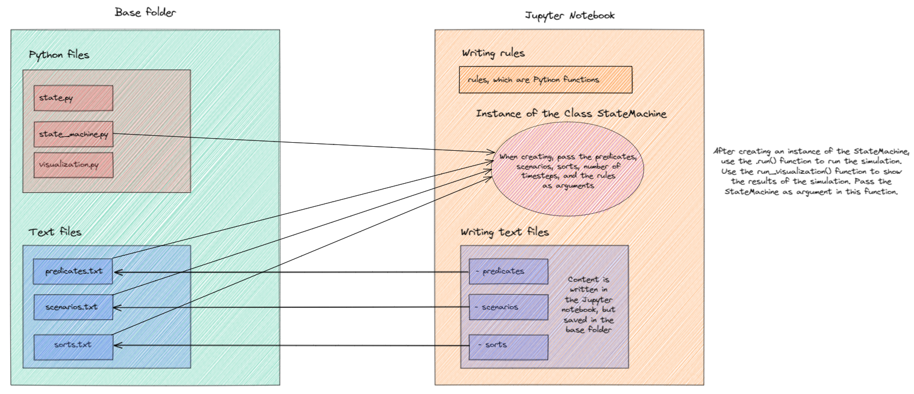

# Overview

There are Python files and text files in the base folder

## Python Files

    The Python files are the <a href="/state/">state.py</a>, <a href="/state_machine/">state_machine.py</a>, and
    <a href="/visualization/">visualization.py</a>.  
    The state.py file contains the State Class and Predicate Class.  
    The State Class consists of all functions and variables relevant for a state. Examples include a function to add
    a predicate to a state and the variable predicates, in which all predicates that exist in a state are stored.  
    The Predicate Class consists of all functions and variables relevant for a predicate. For example, the name of the
    predicate and a function to obtain the agent at a certain index.

## Text files

    The text files are the predicates.txt, scenarios.txt and sorts.txt. The text files are written in the Jupyter Notebook,
    but are stored in the base folder. 
    <ul>
    <li>The predicates.txt consists of all possible predicates in a simulation. The predicates are written as follows:
    *predicate name* ; {*all sorts separated by a ","*}. For example: <em>has_age;   &emsp;     {AGENT, REAL}</em></li>
    <li>The scenarios.txt consists of predefined predicates. First the name of the predicate is written, followed by a
    curly bracket, followed by the values of the sorts, followed by a closing curly bracket. After, there is a semicolon
    followed by a bracket, in which the duration is indicated, followed by a closing bracket. If the predicate is a nested
    predicate, you simply put the name of the nested predicate before the regular predicate and put curly brackets around
    the regular predicate. For example: <em>has_age{Bert, 18}; [1, 50]</em>. Another example: <em>belief{has_age{Bert, 18}}; [1, Inf]</em>.
    Inf indicates that the predicate holds for the whole simulation. </li>
    <li>sorts.txt consists of all sorts, except Boolean and Real, that are being used in the simulation. The sorts are defined
    as follows: first the name of the sort is written, followed by a semicolon. After the semicolon, all possible values
    are written, surrounded by curly brackets and separated by a comma and a space. For example: <em>MOOD; &emsp; {sad, angry, normal, happy}</em>.
    </ul>

[Full image](Schematic overview.png)

